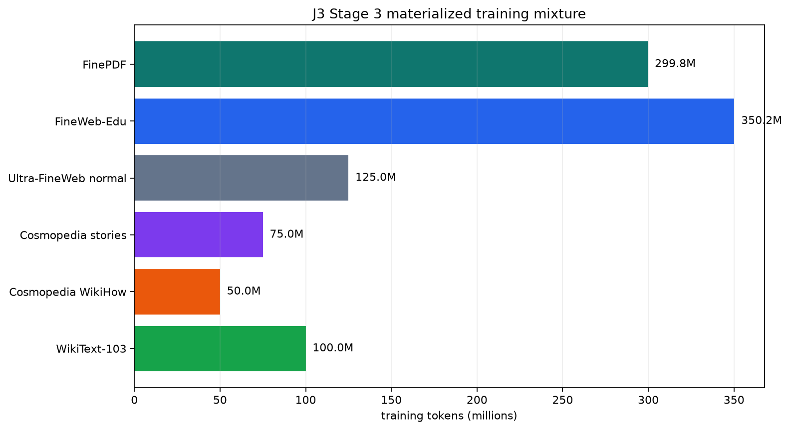
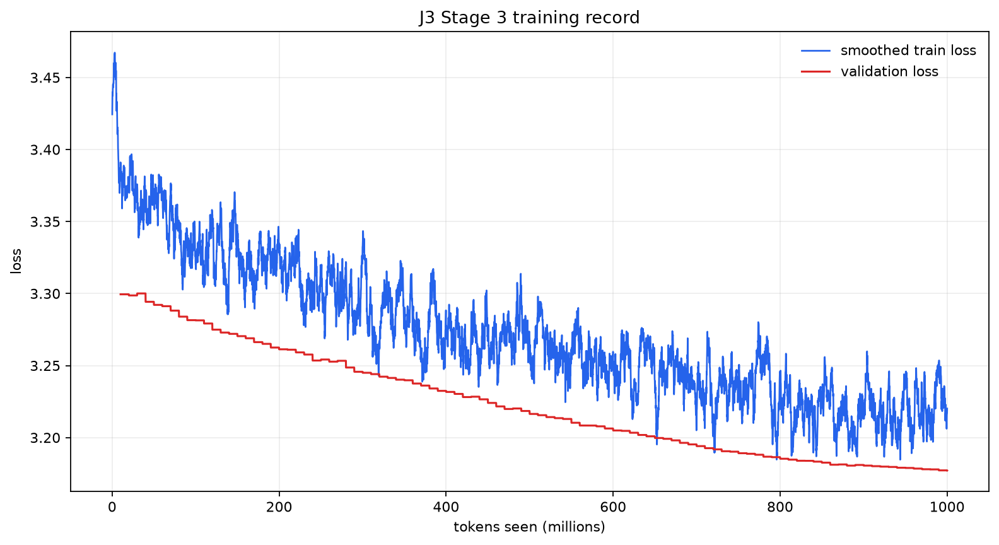
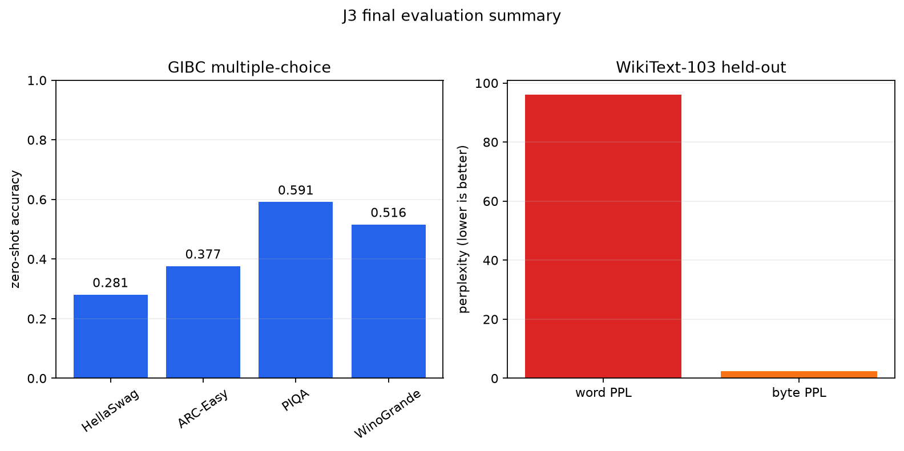

# J3

> A transparent, 49M-parameter decoder-only language model trained from scratch for the Global Innovation Build Challenge V2.

J3 is a compact language model and an auditable training project. The public repository contains the model implementation, deterministic data manifests, tokenizer audit, decontamination index, training metrics, environment snapshots, evaluation adapter, full benchmark output, and the selected checkpoint release.

The submission boundary is intentionally simple: **J3 is the Stage 3 1B-token model**. The later Stage 4 continuation and auxiliary capability/multiple-choice experiments remain visible as historical records, but they are not part of the final release.

[Model release](https://github.com/ddy314/j3/releases/tag/j3-stage3-final) · [Evaluation JSON](docs/evaluation/results/j3-gibc.json) · [Submission checklist](docs/submission/checklist.md) · [Official GIBC V2 rules](https://gibc-v2.devpost.com/rules)

## Final release at a glance

| Field | Selected value |
| --- | --- |
| Public model name | **J3** |
| Competition | Global Innovation Build Challenge V2, Track 01 TECH |
| Selected run | `20260906-225321` |
| Trainable parameters | `49,001,408` (under the 50M cap) |
| Training target / tokens seen | `1,000,000,000` / `1,000,079,360` |
| Training time | `24,595.263 s` on one RTX 4060 Laptop GPU |
| Final training validation | loss `3.1771468282`, perplexity `23.9782418167` |
| Precision / effective batch | BF16 / `131,072` tokens |
| Checkpoint | [download `state.pt`](https://github.com/ddy314/j3/releases/download/j3-stage3-final/state.pt) |
| Checkpoint SHA-256 | `3fcdaf9517e6a847dd36a24dbf982c3ba5293d76bc6616a572662526655aeb27` |
| Tokenizer SHA-256 | `416267157bccdfa2bc6d5025aebf3b9a6a82271f4664f04f0d963337fec35023` |

The public model name is J3. `D32-1216-R12` is retained only as an internal architecture shorthand in historical checkpoints and raw run records; it is not a second model or the submission name.

The [official competition rules](https://gibc-v2.devpost.com/rules) specify the public-repository, from-scratch, parameter-budget, hardware/training disclosure, and benchmark requirements used here.

## Evaluation snapshot

The full zero-shot run uses `lm-evaluation-harness` 0.4.13, `num_fewshot=0`, and the default 100,000 bootstrap iterations. Both raw and normalized accuracy are kept because the harness exposes both metrics.

| Benchmark | Raw accuracy | Normalized accuracy | Samples |
| --- | ---: | ---: | ---: |
| HellaSwag | 0.272456 | 0.280821 | 10,042 |
| ARC-Easy | 0.406987 | 0.376684 | 2,376 |
| PIQA | 0.596844 | 0.591404 | 1,838 |
| WinoGrande | 0.516180 | — | 1,267 |

| Held-out language modeling task | Value | Samples |
| --- | ---: | ---: |
| WikiText-103 word perplexity | 96.123029 | 4,358 |
| WikiText-103 byte perplexity | 2.413220 | 4,358 |
| WikiText-103 bits per byte | 1.270960 | 4,358 |

The complete result file contains standard errors, task configurations, dataset versions, seeds, environment information, and the evaluation source commit: [`docs/evaluation/results/j3-gibc.json`](docs/evaluation/results/j3-gibc.json). The training-loop validation perplexity above is a separate metric and must not be substituted for the held-out WikiText-103 result.

## What the release contains

### Model design

J3 is a fixed decoder-only transformer defined in [`configs/pretrain_stage3_1b.yaml`](configs/pretrain_stage3_1b.yaml) and implemented under [`src/model`](src/model).

| Component | Configuration |
| --- | --- |
| Decoder depth | 32 blocks |
| Model width | 384 |
| Attention | grouped-query attention, 6 query heads / 2 key-value heads |
| Head dimension | 64 |
| MLP hidden width | 1,216 |
| Output head | rank-12 residual output head |
| Normalization | RMSNorm with Q/K normalization |
| Position encoding | RoPE, base 10,000 |
| Activation | xIELU with constrained parameterization |
| Embeddings | tied input/output embeddings |
| Maximum model context | 1,024 tokens |
| Selected train sequence | 512 tokens |
| Vocabulary | 16,384-token byte-level BPE |

All trainable parameters are instantiated locally. J3 does not use external pretrained weights, fine-tuning, distillation, a hosted inference API, or a third-party model endpoint.

### Training recipe

The selected run used:

- BF16 mixed precision, AdamW, gradient clipping at 1.0, and cosine decay from `1e-4` to `1e-5`.
- Micro-batch 16, gradient accumulation 16, and effective batch size 131,072 tokens.
- Seed `1337`, 20M warmup tokens, 10M-token evaluation interval, and deterministic manifest/shard seeds.
- `torch.compile` with the default compile mode on an NVIDIA GeForce RTX 4060 Laptop GPU with 7,834.375 MiB reported memory.
- A Stage 3 initialization from the preceding in-house Stage 2 continuation. That continuation was also trained from random initialization; no external pretrained model entered the chain.

The selected run completed 7,630 optimizer steps. The exact command, configuration snapshot, metrics JSONL, environment, status, and checkpoint metadata are under [`docs/training/raw-runs/20260906-225321`](docs/training/raw-runs/20260906-225321).

### Data mixture

The selected train stream is exactly 1,000,000,000 materialized tokens. It is globally mixed before training in 8,192-token chunks with seed `1337`; runtime shard shuffling adds a second deterministic permutation.

| Source slice | Category | Tokens | Share |
| --- | --- | ---: | ---: |
| FinePDF local artifact | PDF/textbook-like text | 299,793,532 | 29.979% |
| FineWeb-Edu | clean web / educational text | 350,206,468 | 35.021% |
| Ultra-FineWeb L2 normal web | ordinary web, score `0.55–0.80` | 125,000,000 | 12.500% |
| Cosmopedia V2 stories | narrative text | 75,000,000 | 7.500% |
| Cosmopedia V2 WikiHow | procedural text | 50,000,000 | 5.000% |
| WikiText-103 | encyclopedic text | 100,000,000 | 10.000% |
| **Total** |  | **1,000,000,000** | **100.000%** |

The data pipeline records NFKC normalization, control-character filtering, whitespace cleanup, deduplication, token ID range, shard completeness, and the tokenizer hash. Public benchmark decontamination uses exact normalized word shingles of width 12 against HellaSwag, PIQA, ARC, and WinoGrande. Full quotas, filters, provenance, source-card links, and unresolved license questions are in [`docs/data/datasets.md`](docs/data/datasets.md).



### Training and evaluation evidence

These figures are generated from committed records, not hand-entered summaries.

| Evidence | Artifact |
| --- | --- |
| Training curve | [`training-loss.png`](docs/submission/assets/training-loss.png) |
| Data mixture | [`data-mixture.png`](docs/submission/assets/data-mixture.png) |
| Benchmark summary | [`evaluation-summary.png`](docs/submission/assets/evaluation-summary.png) |
| Machine-readable run register | [`experiment-register.json`](docs/training/experiment-register.json) |
| Raw run records | [`docs/training/raw-runs`](docs/training/raw-runs) |
| Selected data manifest | [`stage3-mixed-manifest.json`](docs/data/stage3-mixed-manifest.json) |
| Tokenizer audit | [`tokenizer-audit.json`](docs/data/tokenizer-audit.json) |
| Release binding and hashes | [`release-manifest.json`](docs/submission/release-manifest.json) |





## Download and verify the model

The selected 588,414,613-byte checkpoint is published as the [`j3-stage3-final` GitHub Release](https://github.com/ddy314/j3/releases/tag/j3-stage3-final). The release asset is intentionally not stored in Git history.

```bash
gh release download j3-stage3-final \
  --repo ddy314/j3 \
  --pattern state.pt

sha256sum state.pt
# 3fcdaf9517e6a847dd36a24dbf982c3ba5293d76bc6616a572662526655aeb27  state.pt
```

The release is compatible with the checked-in architecture config, tokenizer, and checkpoint metadata. The canonical binding is [`docs/submission/release-manifest.json`](docs/submission/release-manifest.json); verify the hash before moving the tensor file into a local `runs/j3-stage3-final` checkpoint directory.

## Reproduce and verify

### Install and run repository checks

```bash
uv sync --locked
uv run python scripts/verify_submission.py
uv run pytest -q
```

The submission verifier checks the public model name, exact parameter count, selected 1B-token manifest, global 8,192-token mixing contract, tokenizer hash, and checkpoint hash. The current repository test suite passes with 40 tests.

### Run the official task set locally

Install the optional evaluation dependency and run the checked-in native-model adapter:

```bash
uv sync --locked --extra eval
uv run python scripts/evaluate_gibc.py \
  --checkpoint runs/j3-stage3-final/checkpoints/latest \
  --config configs/pretrain_stage3_1b.yaml \
  --tasks hellaswag arc_easy piqa winogrande j3_wikitext_103 \
  --output docs/evaluation/results/j3-gibc.json
```

For a fast adapter smoke test, add `--limit 2`. The smoke file is kept separately as [`j3-gibc-smoke.json`](docs/evaluation/results/j3-gibc-smoke.json) and must not be reported as the competition score.

The custom WikiText-103 task is defined in [`eval_tasks/wikitext_103.yaml`](eval_tasks/wikitext_103.yaml). The adapter loads only local J3 weights and the checked-in tokenizer; it does not call a hosted model service.

### Start a fresh training run

```bash
uv run python train.py \
  --config configs/pretrain_stage3_1b.yaml \
  --init-from runs/20260905-135527/checkpoints/latest
```

The command above describes the selected continuation path. The preceding intermediate tensor is not part of the public Git tree; its command, metadata, metrics, and environment are preserved in [`docs/training/raw-runs/20260905-135527`](docs/training/raw-runs/20260905-135527). The exact final tensor is distributed through the release asset.

## Honest experiment boundary

The repository keeps the historical evidence for experiments that were explored and rejected:

| Experiment | Release status |
| --- | --- |
| Stage 3 1B, `20260906-225321` | **Selected J3 submission** |
| Stage 4 500M, `20260907-112712` | Completed on a different data/protocol; not selected |
| Capability CPT 125M | Completed auxiliary continuation; not selected |
| Multiple-choice post-training | One OOM run, one short run, one 50M-token run; none selected |

The non-selected tensor files and generated data were removed from the active workspace to prevent accidental submission drift. Their raw commands, metrics, environment snapshots, and checkpoint metadata remain in [`docs/training/raw-runs`](docs/training/raw-runs), with the interpretation documented in [`docs/training/abandoned-experiments.md`](docs/training/abandoned-experiments.md).

## Data, licensing, and assistance disclosure

Raw web and PDF corpora are not redistributed in this repository. Provider dataset cards and source-license notes are linked in [`docs/data/datasets.md`](docs/data/datasets.md). FinePDF is disclosed as a local source artifact with source-file hashes, but its upstream permission record is not present here; redistribution of that source remains an explicit legal verification item.

AI-assisted coding and documentation tools were used during repository preparation. The team selected the architecture, data mixture, experiment boundary, evaluation protocol, and release decision, and is responsible for verifying all measurements and complying with source terms. This disclosure is also recorded in [`docs/submission/built-with.md`](docs/submission/built-with.md).

## Repository map

| Path | Purpose |
| --- | --- |
| [`configs/`](configs) | Authoritative model, data, and training configurations |
| [`src/`](src) | Tokenizer, data stream, model, checkpoint, and training loop |
| [`scripts/`](scripts) | Data preparation, verification, record export, assets, and evaluation |
| [`eval_tasks/`](eval_tasks) | Local `lm-evaluation-harness` task definitions |
| [`docs/data/`](docs/data) | Manifests, tokenizer audit, verification, provenance, and licenses |
| [`docs/training/`](docs/training) | Run register and raw experiment records |
| [`docs/evaluation/`](docs/evaluation) | Protocol and full result artifacts |
| [`docs/submission/`](docs/submission) | Release manifest, project description, Built With, checklist, and visuals |

## Competition readiness

- [x] Public model name changed to J3.
- [x] Final Stage 3 candidate selected and non-selected branches removed from the active path.
- [x] 49,001,408 trainable parameters and from-scratch training disclosed.
- [x] Selected checkpoint published with a reproducible SHA-256 binding.
- [x] Complete training records and data manifests committed.
- [x] Full required evaluation completed and committed.
- [x] Built With and AI-assistance disclosure written.
- [ ] Record the 2–5 minute English demo video.
- [ ] Fill in team members, roles, and contact details.
- [ ] Replace or supplement audit figures with final product/demo screenshots if required by the submission form.
- [ ] Re-check the live Devpost form and source-license status immediately before submission.

The detailed, submission-facing checklist is [`docs/submission/checklist.md`](docs/submission/checklist.md).
